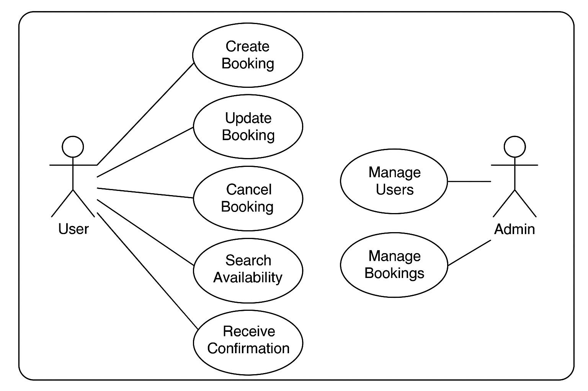

# Requirement Analysis in Software Development
This repository is dedicated to exploring, documenting, and sharing knowledge on requirement analysis in software development. It aims to serve as a resource for both beginners and experienced professionals looking to understand or refine their skills in gathering, analyzing, and documenting software requirements. Through examples, case studies, and best practices, this repository will delve into the methodologies and tools that facilitate effective requirement analysis.

## What is Requirement Analysis?
Requirement Analysis is a critical phase in the Software Development Life Cycle (SDLC) where the needs and expectations of stakeholders are gathered, analyzed, documented, and validated to define the scope and functionality of a software system. This phase acts as the foundation upon which the entire project is built.

### Importance of Requirement Analysis in SDLC
* **Clarifies Expectations:**  By clearly defining the requirements, it eliminates ambiguity and ensures that all stakeholders are on the same page.
* **Reduces Risks:** Identifying and resolving ambiguities early helps to prevent scope creep, miscommunication, and costly rework later.
* **Improves Planning:** With well-defined requirements, project teams can estimate timelines, costs, and resources more accurately.
* **Ensures Quality:** A thorough understanding of requirements leads to better design, development, and testing, improving the final product’s quality.
* **Supports Validation:** Well-documented requirements help in verifying that the developed system meets the intended goals.

By performing requirement analysis effectively, software development teams can ensure that their products meet the needs and expectations of their users, leading to higher satisfaction and reduced costs

## Why is Requirement Analysis Important?
Requirement analysis is a vital component of the SDLC, and its importance cannot be overstated. Here are three key reasons why requirement analysis is critical:

- 1. **Prevents Costly Rework**
One of the primary benefits of requirement analysis is that it helps prevent costly rework. When requirements are not clearly defined, it can lead to misunderstandings and misinterpretations, resulting in costly changes later in the development process. By investing time and effort in requirement analysis, teams can identify and address potential issues early on, reducing the likelihood of costly rework.

- 2. **Ensures Stakeholder Satisfaction**
Requirement analysis ensures that the software system meets the needs and expectations of its stakeholders. By gathering and analyzing requirements from stakeholders, teams can identify and prioritize the features and functionalities that are most important to them. This leads to higher stakeholder satisfaction and adoption rates.

- 3. **Enables Better Project Planning**
With well-analyzed requirements, teams can accurately estimate the scope, cost, and timeline of a project. This helps in resource allocation, budgeting, and setting realistic deadlines, leading to better project management and fewer surprises down the line.

## Key Activities in Requirement Analysis
Requirement Analysis involves a set of structured activities that help define and manage software requirements effectively. Below are the five key activities involved in this process:

- **Requirement Gathering**  
  This is the initial step where all potential requirements are collected from stakeholders, users, clients, and subject matter experts. The goal is to gather as much relevant information as possible about the system’s needs and expectations.

- **Requirement Elicitation**  
  Elicitation goes beyond just collecting data — it involves engaging with stakeholders using techniques such as interviews, surveys, brainstorming sessions, workshops, and observation to uncover implicit, conflicting, or hidden requirements.

- **Requirement Documentation**  
   Recording requirements in a structured format. This documentation serves as a reference for both development and validation, and often includes functional and non-functional requirements, use cases, and user stories.

- **Requirement Analysis and Modeling**  
  In this step, the documented requirements are analyzed to identify ambiguities, inconsistencies, and redundancies. Modeling techniques like data flow diagrams (DFD), use case diagrams, and entity-relationship diagrams (ERD) are used to visualize and refine the requirements.

- **Requirement Validation**  
  Ensuring requirements are correct, complete, and agreed upon.

  ## Types of Requirements
In software development, requirements are typically categorized into two main types: Functional and Non-functional. Both are essential for building a successful and complete system.

### Functional Requirements
Functional requirements define **what the system should do** — the specific behaviors, functions, or features the software must support.

**Examples for a Booking Management Project:**
- Users can create, view, update, and cancel bookings.
- Admins can manage user accounts and booking details.
- The system sends confirmation emails after a successful booking.
- Users can search for available time slots based on date and service.
- The system prevents double booking for the same slot.

### Non-functional Requirements
Non-functional requirements describe **how the system performs** its functions. These include performance, usability, reliability, and other quality attributes.

**Examples for a Booking Management Project:**
- The system must respond to user actions within 2 seconds.
- The application should be available 99.9% of the time.
- User data must be encrypted during transmission and storage.
- The system should support at least 10,000 concurrent users.
- The interface must be accessible on both mobile and desktop devices.

## Use Case Diagrams
A Use Case Diagram is a visual representation that shows how different types of users (actors) interact with a system. It helps in understanding the functional requirements by identifying major interactions between users and the system.

### Benefits of Use Case Diagrams
- Simplifies complex system functionalities.
- Enhances communication between stakeholders.
- Helps identify and validate functional requirements early.
- Serves as a foundation for further system design.

### Use Case Diagram for Booking Management System
The diagram below shows the primary actors and use cases involved in a booking management system.

()

## Acceptance Criteria
Acceptance Criteria are specific, measurable conditions that a software product must satisfy to be accepted by a user, customer, or other stakeholders. They define the boundaries of a user story or feature and provide a clear basis for testing and validation.

### Importance of Acceptance Criteria in Requirement Analysis
- **Clarifies Expectations:** Ensures all stakeholders have a shared understanding of what success looks like for a given feature.
- **Guides Development:** Helps developers know exactly what to build and when the work is complete.
- **Enables Testing:** Forms the basis for test cases and quality assurance activities.
- **Prevents Scope Creep:** Defines what is in and out of scope for a feature, reducing miscommunication and rework.

### Example: Acceptance Criteria for Checkout Feature

**Feature:** Checkout (Booking Management System)

**Acceptance Criteria:**
- The user must be able to review their selected booking details before payment.
- The system must display the total cost including taxes and fees.
- The user must be able to enter and validate payment information securely.
- A confirmation message must be displayed after successful payment.
- An email confirmation must be sent within 5 minutes of successful checkout.

